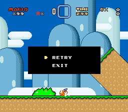
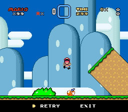
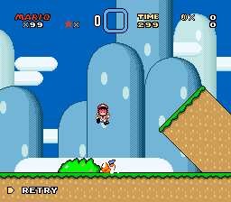
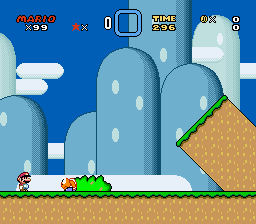
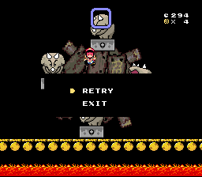

## Retry System

If you just stumbled here and have no idea what this is about, check out [SMWCentral](https://www.smwcentral.net/).

### Description

This is the modern Retry System that extends and improves the [original patch](https://smwc.me/1657727) by [worldpeace](https://www.smwcentral.net/?p=profile&id=1250). Its base features are the same as the old patch, but there's a lot of new functionalities and customizations available, which make it an useful tool also for projects where a retry system is not needed. Additionally, being implemented as an UberASM project, it features much less hijacks than the original patch, making it compatible with more resources. [UberASM Tool](https://smwc.me/s/39036) version 2.1 or higher is required.

The main features implemented are:
- Level respawn on death without going to the Overworld (with prompt or instant)
- Customizable Retry prompt appearance (box/bar/minimal)
- Multiple midways per level
- Automatic midways when entering a sublevel
- Customizable sprite status bar that replaces the vanilla one
- Death counter
- Integrated save system to retain checkpoints and other things in SRAM
- Title screen death fix
- Counterbreak (state reset when respawning or going to the Overworld)
- Miscellaneous bug fixes

See [Documentation](https://kkevinm.github.io/retry-system/) for more details.

### Screenshots

")

")

